# Keycloak User Sync

An **OIDC-protected admin tool** to list and synchronise users across identity directories — driven from a Bootstrap web console, with **banking-grade secret handling**, **dry-run previews**, an **audit log**, and **scheduled (cron) syncs**.

Two independent, fully configurable sync paths:

- **Samba AD → Keycloak** — reads Active Directory over LDAP, writes users into a target Keycloak via the Admin REST API.
- **Keycloak → Keycloak** — copies users from a source bank Keycloak into a target bank Keycloak.

Connections are **saved profiles** (UBS/CS/Samba ship pre-seeded; add any). Secrets live in **HashiCorp Vault**; Keycloak access uses **least-privilege service-account clients** — there is no stored admin password.

---

## Screenshots

| | |
|---|---|
| **Login** (OIDC) | **Connections** (seeded profiles) |
| 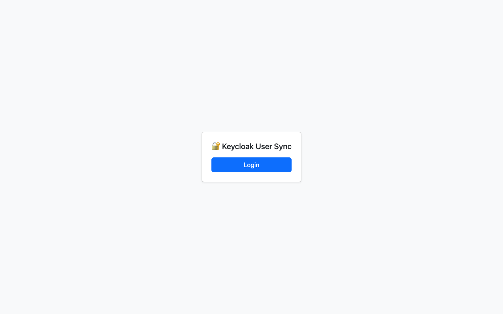 | 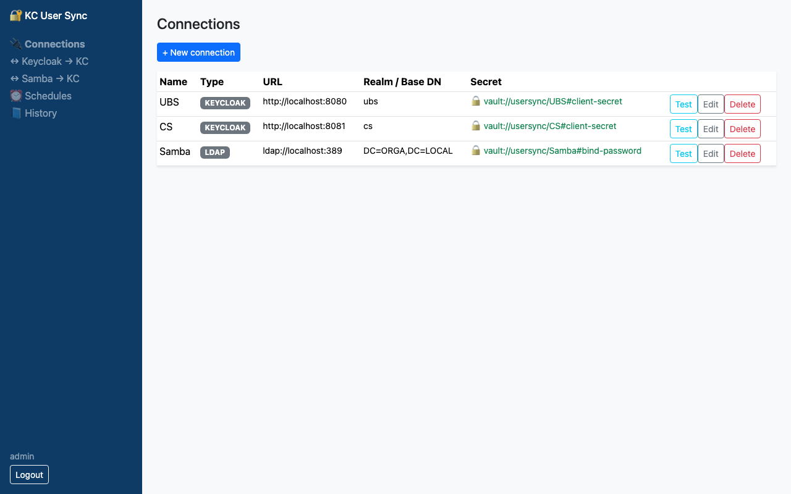 |
| **Test connection** (service account) | **Dry-run preview** (before any write) |
| 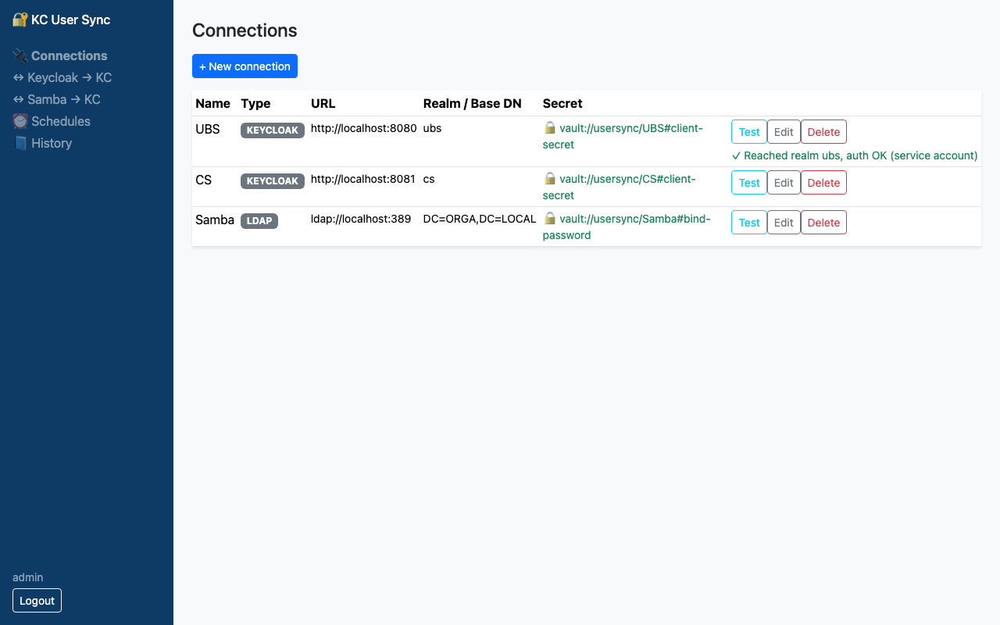 | 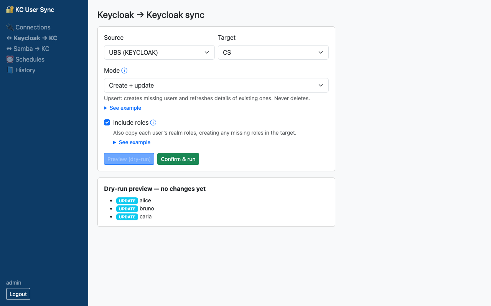 |
| **Sync result** | **History** (audit log) |
| 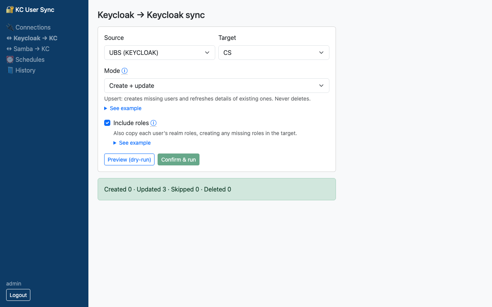 | 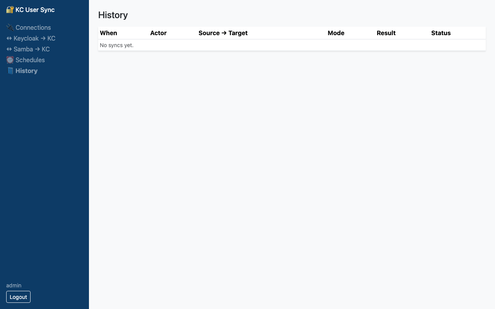 |

*(Screenshots are generated by the Playwright walkthrough — see [Testing](#testing).)*

---

## Features

- **Configurable connections** — manage Keycloak/LDAP connection profiles in the UI; works for any instance.
- **Two sync flows** — Samba→Keycloak and Keycloak→Keycloak, each with selectable source/target.
- **Configurable sync modes** — `create-only`, `create + update`, `mirror` (deletes extras); optional **include roles** (auto-creates missing roles).
- **Dry-run preview** — see exactly which users would be created / updated / deleted before running.
- **Scheduled syncs** — recurring cron jobs (Spring 6-field, e.g. `0 0 2 * * ?` = daily 02:00), managed in the UI, with **Run now**; each run is audited.
- **User watches (scoped reconciliation)** — watch a chosen set of users (hand-picked list *or* filter) and keep exactly them reconciled on a target Keycloak on a cron. Disable always propagates; removal follows a per-watch policy (`disable` / `delete` / `ignore`); each watch runs `report-only` (dry-run) or `enforce`. Scoped by design — a watch never touches users outside its governed set — with a persisted member snapshot and full audit trail.
- **Audit log** — every run recorded (actor, source→target, mode, counts incl. disabled, status).
- **Banking-grade secrets** — stored in HashiCorp Vault; the app DB holds only a `secretRef`. No end-user passwords stored (OIDC login).

---

## User watches (scoped reconciliation)

Beyond whole-realm sync, a **watch** governs *only* a chosen set of users — a safer, auditable shape for production directories. Safe defaults: **report-only** and **disable (not delete)** on removal.

| | |
|---|---|
| **Watches** list | **New watch** — pick specific users |
| 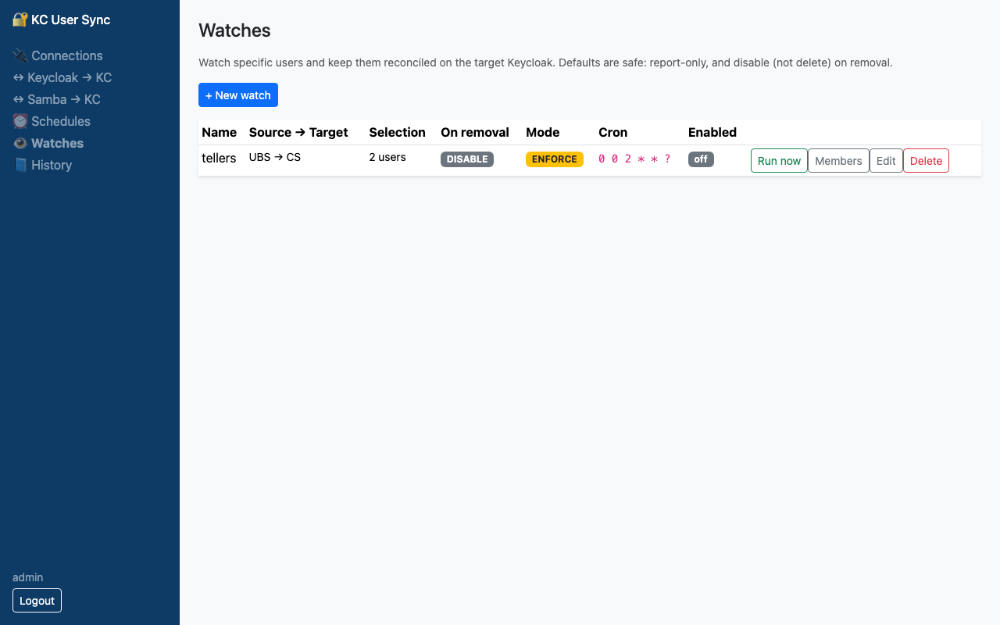 | 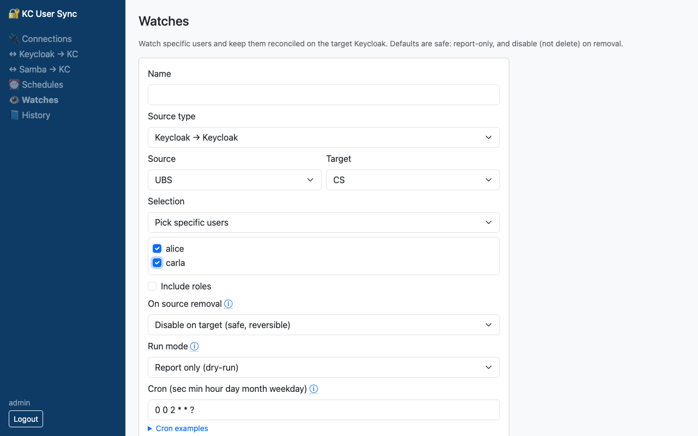 |
| **Filter + on-removal policy + run mode** | **Members** — governed-identity snapshot |
| 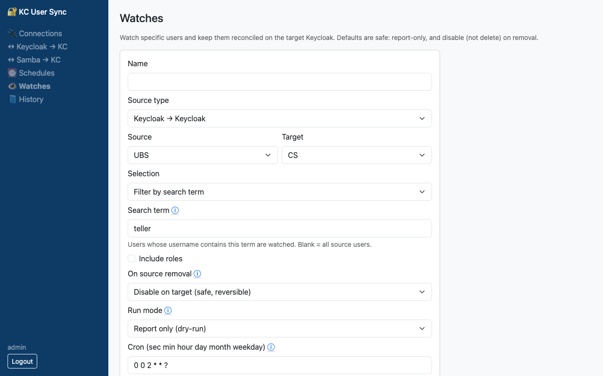 | 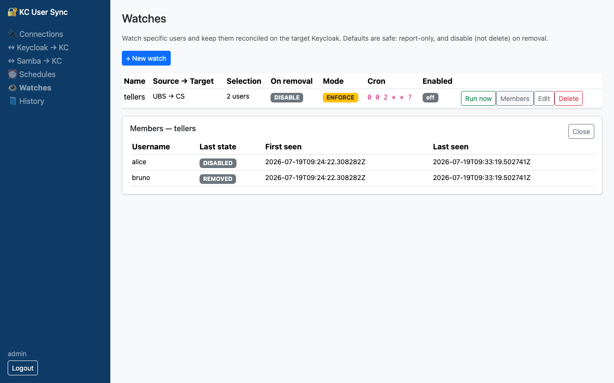 |

**History** — the immutable audit trail: report-only (`REPORT`) vs enforce (`OK`), with the disable (`⊘`) counts.

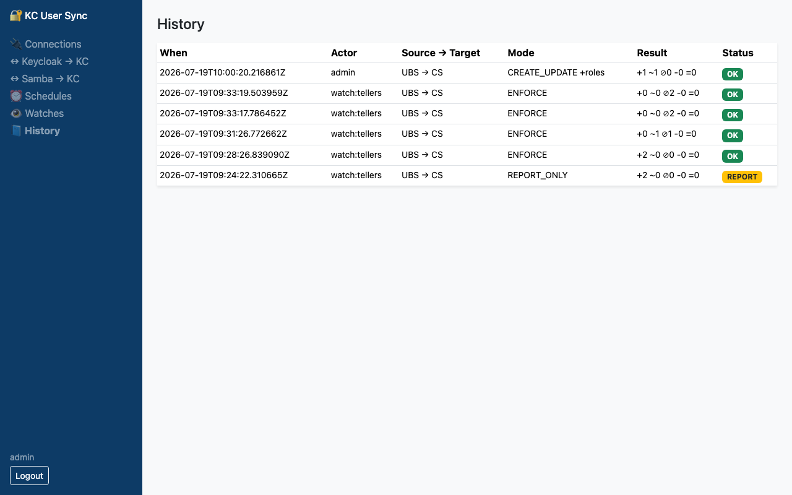

- **Select** users explicitly (checkboxes from the source) or by a **filter** term.
- **On source removal**: `DISABLE` (default) · `DELETE` · `IGNORE`, per watch.
- **Run mode**: `REPORT_ONLY` (dry-run — records what *would* change) or `ENFORCE`.
- **Disable always propagates** (source-disabled → target disabled).

Run the walkthrough that generated these screenshots (needs the full stack up):
`cd frontend && npx playwright test watches-walkthrough`

---

## Architecture

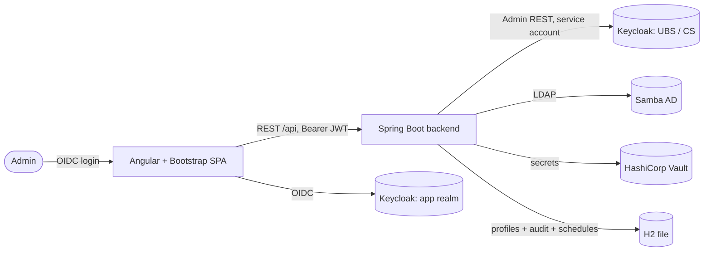

Full breakdown (C4/arc42): [`docs/architecture.md`](docs/architecture.md).
Secret-handling rationale + standards mapping: [`docs/security-audit.md`](docs/security-audit.md).

**Tech stack:** Spring Boot 3.3 (Java 21), Spring Data JPA + H2, spring-vault-core, keycloak-admin-client · Angular 18 + Bootstrap 5 · HashiCorp Vault · Docker Compose.

---

## How connections authenticate (service accounts & secrets)

Every directory the tool talks to is a **saved connection profile**. A profile pairs an *identity* with a *secret* — but the secret is never kept inside the app. The app database stores only a **pointer** to it; the real value lives in **Vault** and is fetched at the moment it's needed. There are two kinds of connection, each with its own credential style.

### Keycloak connections (e.g. UBS, CS)

The tool authenticates as a **confidential service-account client** — a *machine* identity, never a person — using the OAuth2 **client-credentials** grant. No human logs in, and no end-user password exists anywhere in the flow.

Two distinct things combine, and it helps to keep them separate:

| Question | Answered by | How |
|---|---|---|
| **"Who is calling?"** | the **client** (`user-sync-agent`) | proves itself with a **client secret** |
| **"What may it do?"** | the client's **service account** | carries least-privilege `realm-management` roles (view / query / manage users) |

Authenticating only gets the caller *in*; it grants no access on its own. What the agent is allowed to read or change comes entirely from the roles on its service account. The client is deliberately locked down — confidential (secret-based), **service-accounts only**, with browser login and username/password grants switched off — so it can be used *only* for machine-to-machine calls, never to impersonate a user.

### LDAP / Samba connections

Same secret-handling logic, a different credential: the tool binds to the directory with a **bind DN** and a **bind password** (also stored in Vault). No OAuth is involved.

### Where the secret lives — and where it doesn't

| Layer | What it holds |
|---|---|
| **App DB (H2)** | only a *reference*, e.g. `vault://usersync/UBS#client-secret` — never the secret value |
| **Vault** | the actual value, at path `secret/usersync/UBS` under the key `client-secret` |
| **Backend (memory)** | the value only *transiently* — resolved per call to build the token request, never persisted |

So a leak of the app database exposes no credentials — only the names of the Vault entries to look up (which are themselves useless without Vault access).

### The flow, end to end

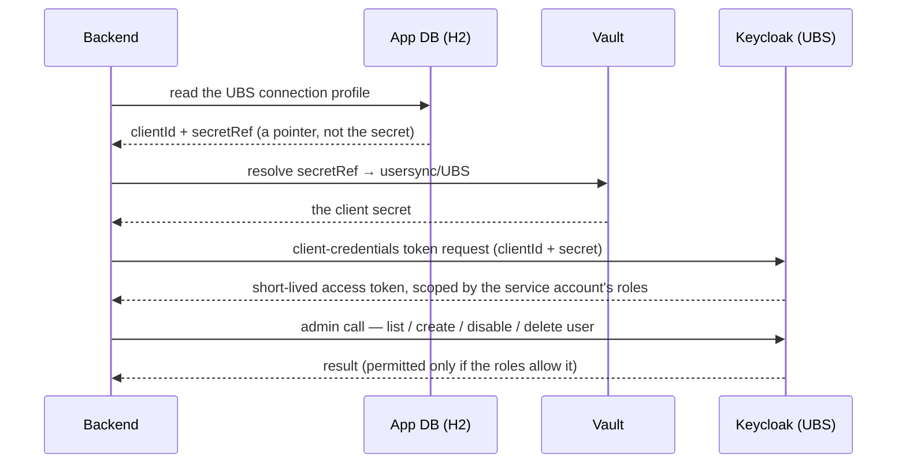

### Why it's shaped this way (audit rationale)

- **No end-user passwords** are ever stored, transmitted, or required — people sign in to the console via OIDC; the tool acts on directories as a machine.
- **Least privilege:** a dedicated client per environment with only the user-management roles it needs — no realm-admin, no master admin.
- **Separation of duties:** *identity* (the secret) and *authorisation* (the roles) are independent; rotating the secret doesn't change permissions, and tightening permissions doesn't touch the secret.
- **Secrets stay in Vault:** the app holds a reference only, and access tokens are short-lived, so nothing long-lived and sensitive sits in the app tier.

> The dev stack uses a weak, well-known secret (`agent-secret`, baked into the realm import for convenience). In a real deployment this is a strong, rotated secret that is never committed anywhere. See [`docs/security-audit.md`](docs/security-audit.md) for the full standards mapping.

---

## Quick start

**Prerequisites:** Docker + Compose, Java 21, Node 20.

```bash
# 1. Infrastructure — 3 Keycloaks + Vault + Postgres
docker compose up -d postgres-ubs postgres-cs postgres-app keycloak-ubs keycloak-cs keycloak-app vault

# 2. Backend (http://localhost:9090) — seeds UBS/CS/Samba connections on first run
cd backend && mvn spring-boot:run

# 3. Frontend (http://localhost:4200)
cd frontend && npm install && npm start
```

Open **http://localhost:4200** and log in with **`admin` / `admin`**.
Add `docker compose up -d samba-ad` to exercise the Samba → Keycloak flow.

> **Hostnames:** reach each Keycloak admin console by a distinct host (browser cookies are scoped by host, not port) — `ubs.localtest.me:8080`, `cs.localtest.me:8081`, `app.localtest.me:8082` (all resolve to `127.0.0.1`). The app logs in via `app.localtest.me:8082`.

---

## Testing

```bash
# Backend unit tests
cd backend && mvn test

# Frontend unit tests
cd frontend && npm test -- --watch=false --browsers=ChromeHeadless

# End-to-end walkthrough (regenerates the screenshots above) — needs the full stack running
cd frontend && npx playwright install chromium   # first time only
npx playwright test
```

---

## Documentation

| Doc | Contents |
|---|---|
| [`docs/README.md`](docs/README.md) | Detailed usage guide + walkthrough |
| [`docs/architecture.md`](docs/architecture.md) | C4/arc42 architecture |
| [`docs/security-audit.md`](docs/security-audit.md) | Secret handling + standards (PCI-DSS, NIST, OWASP) |
| [`docs/superpowers/specs/`](docs/superpowers/specs/) | Design specs |
| [`docs/superpowers/plans/`](docs/superpowers/plans/) | Implementation plans |
