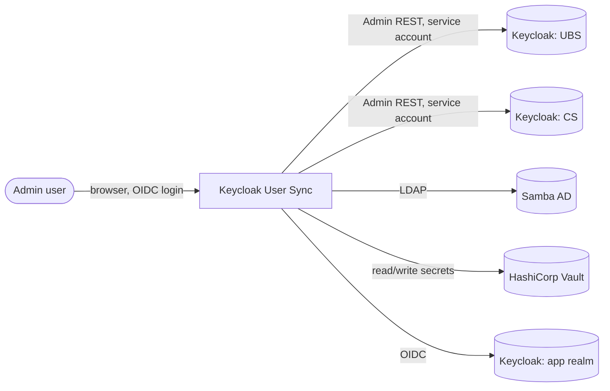
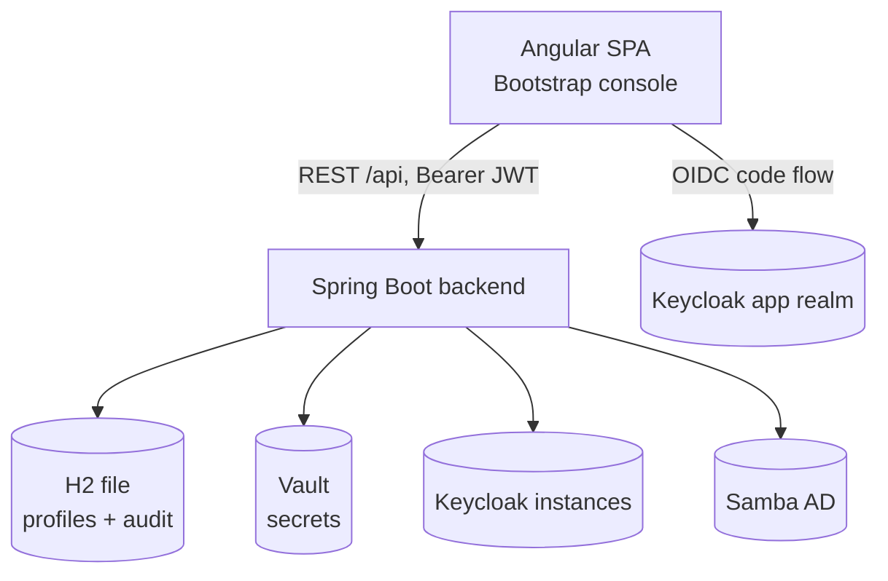
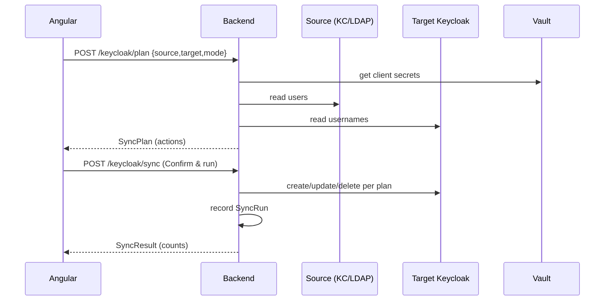

# Architecture — Keycloak User Sync

Structured after arc42, with C4 levels 1–3. Companion docs: [`README.md`](README.md) (run/use), [`security-audit.md`](security-audit.md) (secret handling).

## 1. Introduction & goals

A configurable admin tool to list and synchronise users between identity directories (Samba AD and Keycloak realms). Quality goals, in priority order:

1. **Security** (banking-grade) — no stored admin passwords, secrets in a vault, least privilege, auditable.
2. **Configurability** — any Keycloak/Samba, managed as saved connection profiles.
3. **Usability** — self-explanatory options (inline help + examples), dry-run before any change.
4. **Auditability** — every sync recorded.

## 2. Constraints

- Keycloak 25, Java 21 / Spring Boot 3.3, Angular 18 + Bootstrap 5.
- HashiCorp Vault for secrets (dev mode locally). Embedded H2 for profile/audit metadata.
- Keycloak Admin API accessed **only** via service-account clients (client-credentials).
- Two **independent** sync pipelines (no shared engine) — a deliberate design choice.

## 3. Context (C4 L1)

The admin authenticates against the `app` realm; the tool then talks to source/target directories on the admin's behalf using its own service-account credentials.

## 4. Containers (C4 L2)

| Container | Responsibility |
|---|---|
| Angular SPA | OIDC login; sidebar console (Connections, sync flows, History); dry-run preview → confirm |
| Spring Boot backend | REST API; connection CRUD; secret resolution; service-account Keycloak access; sync planning/execution; audit |
| H2 (file) | Connection profiles (metadata + `secretRef`) and `SyncRun` audit rows — **no secrets** |
| Vault | Connection secrets (`usersync/<name>`) |
| Keycloak (ubs/cs/app) | Identity directories + the app's own auth realm |
| Samba AD | LDAP user source |

## 5. Components (C4 L3 — backend)

| Component | Role |
|---|---|
| `ConnectionService` / `ConnectionRepository` | CRUD of profiles; writes secrets to `SecretStore`, stores `secretRef` |
| `SecretStore` → `VaultSecretStore` | Read/write secrets in Vault (KV v2) |
| `ServiceAccountKeycloakFactory` | Builds a `Keycloak` admin client via client-credentials from a connection |
| `KeycloakSyncService` | KC→KC: read source, `computePlan`, execute, audit |
| `SambaSyncService` | LDAP→KC: read via `SambaUserRepository`, `computePlan`, execute, audit |
| `ConnectionTestService` | Validate a profile (KC token / LDAP bind) |
| `AuditService` / `SyncRunRepository` | Persist and list `SyncRun` records |
| `DefaultDataSeeder` | Idempotent zero-setup seeding of UBS/CS/Samba |

**How a sync flows:** resolve source & target connections → build service-account admin clients (secrets from Vault) → read source users + target usernames → `computePlan(source, existing, mode)` produces per-user `CREATE/UPDATE/DELETE/SKIP` → (dry-run stops here) → execute applies the plan (auto-creating missing roles when `includeRoles`) → `AuditService` records a `SyncRun`.

## 6. Runtime scenarios

**Dry-run then sync:**

**Test connection:** `POST /api/connections/{id}/test` → KC: obtain a service-account token and read the realm; LDAP: bind + base lookup. Any failure is returned as `{ok:false, message}` rather than an exception.

## 7. Data model

- **`Connection`**: `id, name, type(KEYCLOAK|LDAP), serverUrl, realm|baseDn, clientId|bindDn, userSearchBase, secretRef, createdAt`. Holds **only** a `secretRef` (`vault://usersync/<name>#<field>`), never the secret.
- **`SyncRun`**: `id, timestamp, actor, sourceConn, targetConn, mode, includeRoles, created, updated, deleted, skipped, errorCount, status`.

## 8. Cross-cutting concerns

- **Authentication**: app protected by OIDC (`app` realm); Admin API via service-account clients only.
- **Secrets**: Vault; H2 stores references. See `security-audit.md`.
- **Error handling**: per-user failures are collected into the `SyncResult` and never abort the batch; `status` becomes `PARTIAL`.
- **Configuration**: H2 datasource + Vault endpoint in `application.yml`; connections managed at runtime.

## 9. Architecture decisions (ADR-style)

| Decision | Rationale |
|---|---|
| Two independent sync pipelines | Keeps Samba/LDAP and KC/REST concerns isolated; simpler to reason about than a shared engine |
| Service-account-only Keycloak auth | Removes stored admin passwords; least privilege; strongest audit story |
| Vault for secrets, H2 for metadata | Secrets never touch the app DB; metadata is non-sensitive and self-contained |
| Dry-run + audit log | Safety before mutation; traceability after — both expected in banking |

Full requirements: [`superpowers/specs/2026-07-18-configurable-ui-ux-design.md`](superpowers/specs/2026-07-18-configurable-ui-ux-design.md).
